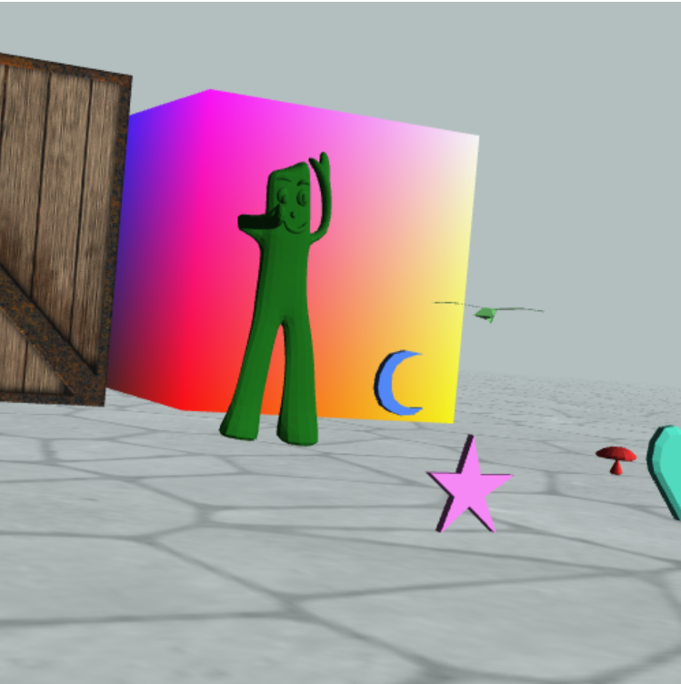
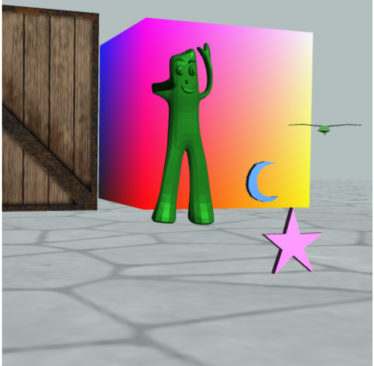

# Report 3

20302010043 苏佳迪

## 项目信息

### 项目目录

```bash
.
├── 3DWalker.html			（主页面）
├── 3DWalker.js				（主代码）
├── Camera.js				（相机）
├── Cube.js					（立方体）
├── Gumby.js				（绕海宝的旋转）
├── Keyboard.js				（键盘响应）
├── MyVector3.js			（Vector3）
├── Object.js				（模型）
├── Texture.js				（纹理）
├── image					（图片）
│   ├── boxface.bmp
│   ├── floor.jpg
│   └── sky.jpg
├── lib						（依赖）
│   ├── cuon-matrix.js
│   ├── cuon-utils.js
│   ├── webgl-debug.js
│   └── webgl-utils.js
├── model					（模型）
│   ├── bird.obj
│   ├── bunny.obj
│   ├── floor.obj
│   ├── gumby.obj
│   ├── heart.obj
│   ├── moon.obj
│   ├── mushroom.obj
│   └── newstar.obj
├── objLoader.js			（加载Object）
└── scene.js				（数据）
```

### 开发与运行环境

浏览器：最新版本Google Chrome

### 运行及使用方法

用浏览器打开`3DWalker.html`即可

## 项目中的亮点

### 实现雾化

为纹理对象、模型对象以及立方体添加了雾化效果，计算视点到到观察点的距离，根据雾化因子调整其颜色：

```c
float fogFactor = clamp((u_FogDist.y - v_Dist) / (u_FogDist.y - u_FogDist.x), 0.0, 1.0);
vec3 colorAfterFog = mix(u_FogColor, vec3(color), fogFactor);
gl_FragColor = vec4(colorAfterFog, color.a);
```

### 实现Phong Shading

为模型对象实现实现了Phong Shading，一方面为其添加了镜面反射光，实现了高光效果（主要体现在海宝的头部、左手与双脚）；另一方面将着色的代码从顶点着色器调整到了片元着色器，逐片元着色（用中程向量降低计算开销）。

计算各个光照的代码如下：

```c
float nDotL0 = pow(clamp(dot(normal, halfLE), 0.0, 1.0), 50.0);
float nDotL1 = max(dot(u_LightDirection, normal), 0.0);
float nDotL2 = max(dot(pointLightDirection, normal), 0.0);

vec3 specular = u_DiffuseLight * u_Color * nDotL0;
vec3 diffuse = u_DiffuseLight * u_Color * nDotL1 + u_PointLightColor * u_Color * nDotL2;
vec3 ambient = u_AmbientLight * u_Color;
```

加入高光前后的对比如下，

高光前：



高光后：




### 绕海宝旋转的实现

对于动画，实现了小鸟绕海宝旋转（变换后的轴）。首先确定海宝变换前的轴为(0, 0, 0)指向(0, 1, 0)，变换后的轴记为V轴，那么动画的需求就变成了变换后的小鸟绕V轴旋转，即一个绕任意轴旋转的问题，那么小鸟坐标的变换如下：

1. 执行自己的变换；
2. 做海宝的逆变换；（此时将问题转换为了绕(0, 0, 0)到(0, 1, 0)旋转）
3. 旋转angle角度；
4. 做海宝的变换；（得到最终的坐标）

后面三步封装为一个矩阵，代码如下：

```js
static getMatrix(angle) {
    // 先逆变换回绕(0, 1, 0)转 inverse；绕(0, 1, 0)旋转angle rotate，再做一次变换model
    return new Matrix4().set(Gumby.modelMatrix)
                        .rotate(angle, Gumby.axis[0], Gumby.axis[1], Gumby.axis[2])
                        .concat(Gumby.inverseMatrix);
}
```

从而实现了绕海宝的旋转，并且这部分代码与Object并没有耦合，对于海宝参数的修改也可以方便地调整。

## 开发过程中遇到的问题

1. 如何实现绕海宝旋转的动画，实现见上面的部分；

2. 在实现动画的过程中，开始时会出现旋转速度先递增再递减的情况，最终发现是没有更新Object对象的modelMatrix矩阵，有上次变换矩阵的残留信息影响；

3. 在实现雾化时，采取过通过`gl_Position.w`这种方式降低计算开销，提高性能，但在地板的纹理上会出现多余的纹路，如下：

    